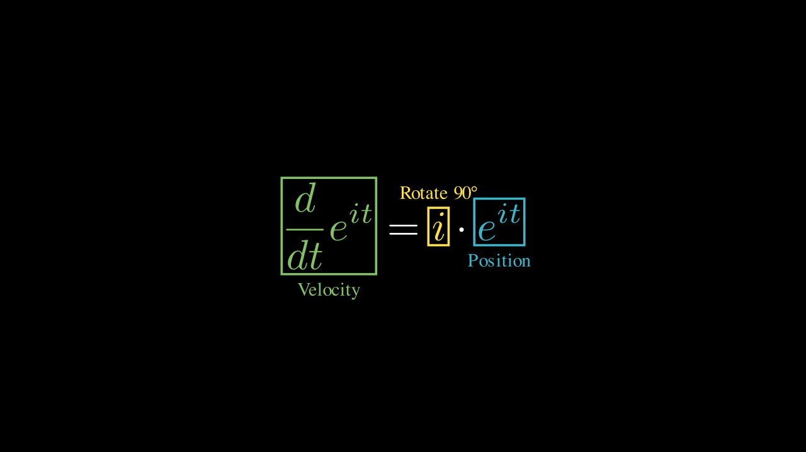
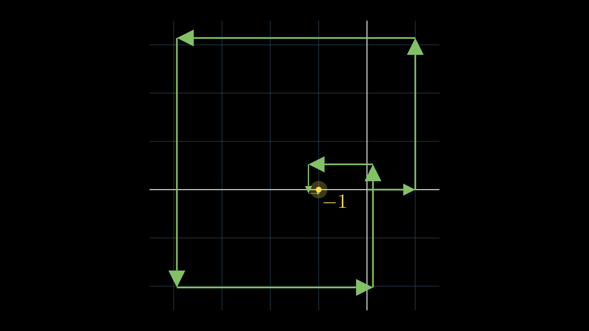
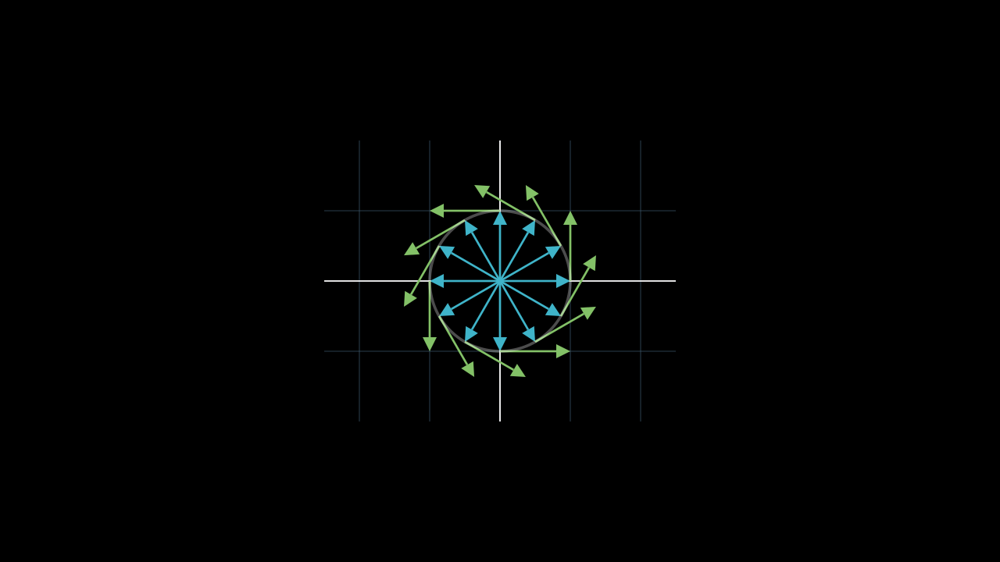

# Designing Math reference visuals

Three reference stills reproducing visuals from Grant Sanderson's talk
"Designing Math" (Config 2026, youtu.be/bLSLN96Gn-w), rendered with the helpers
in [`../../templates/style.py`](../../templates/style.py). They illustrate
catalog patterns 27, 28, and 29 and the entity-color binding in
[`../../rules/color-palettes.md`](../../rules/color-palettes.md).

| Still | Pattern | Idea |
|-------|---------|------|
|  | 27 Role-Labeled Equation Boxes | Box each part of `d/dt e^{it} = i·e^{it}` in its color and label its job (Velocity, Rotate 90°, Position). The visual form of "give your characters motivation." |
|  | 28 Tip-to-Tail Vector Walk | The Taylor series of `e^{iπ}` drawn as tip-to-tail arrows that spiral inward and land on -1. Answers "what does it look like?" |
|  | 29 Vector Field Reveals the Rule | Position vectors (teal) with velocity = a 90° rotation of position (green). The circular motion becomes inevitable. Answers "why is it true?" |

Re-render any still:

```bash
manim -s -qm designing_math_demo.py P27RoleBoxes
manim -s -qm designing_math_demo.py P28VectorWalk
manim -s -qm designing_math_demo.py P29VectorField
```
